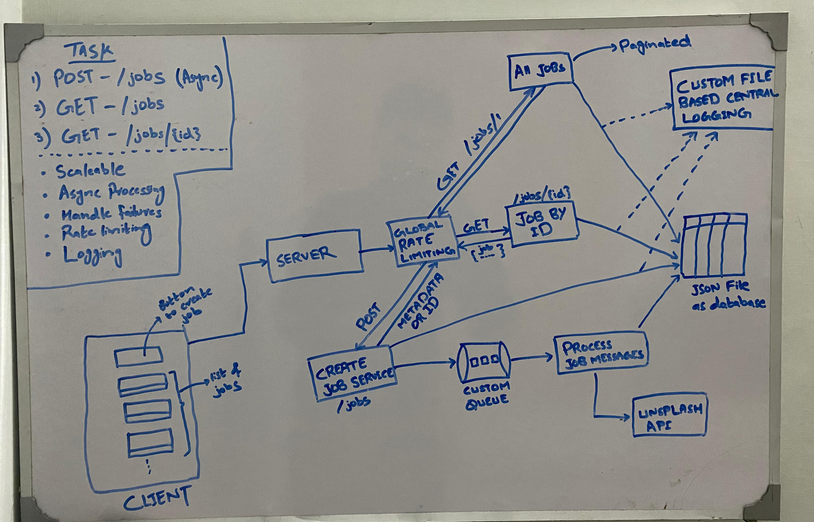
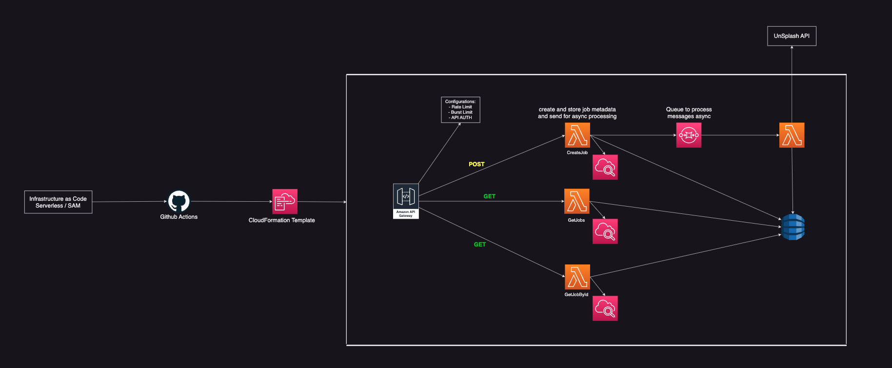
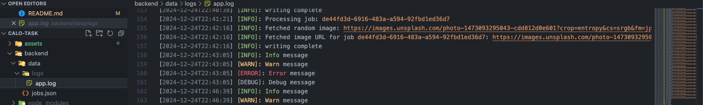
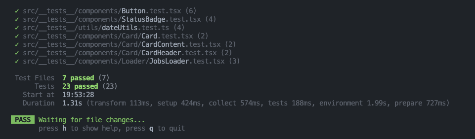

## Getting Started

Clone the repository to your local machine and ensure that Node.js and npm are installed.

## Tech Stack

**Backend:**

- Node.js
- Express
- Jest (for testing)

**Frontend:**

- Vite with React
- TypeScript
- React Query
- Tailwind CSS
- Jest + Vitest (for testing)

## Setup Instructions

### Backend Setup

1. After cloning the repository locally, open a terminal (either a separate terminal or the VSCode terminal) and navigate to the backend folder.

```bash
cd backend
```

2. Next, you need to set up the `.env` file (bad practice). Since we are using the Unsplash API, you'll need the API credentials, which should be stored in the `.env` file inside `backend` folder.

```
PORT=5001
UNSPLASH_ACCESS_KEY=LdasrSphm2_aHvvuZGtcrPjHLi40bek0rPGuB0hYA0k
UNSPLASH_SECRET_KEY=pAU-q3YfZifakRsa12QHZAEzbxWd6zVpC4EuOU2rV1U
```

Note: Typically, these credentials should be stored in a secure file with restricted access.

3. Install packages and start the server:

```bash
npm install
npm run dev
```

This will start the development server on your local machine so you can run and test the backend locally.

### Frontend Setup

1. Open a new terminal (keep the backend running) and go to the frontend folder:

```bash
cd frontend
```

2. Install packages and start the frontend:

```bash
npm install
npm run dev
```

3. This will start the frontend. Click on the URL displayed in the terminal, and it will open the application in your browser.

## Architecture

Our backend has:

1. JSON file as a database
2. IP-based rate limiting for API calls
3. Custom queue for handling messages
4. Central system for logging everything

The current implementation requires us to build many components ourselves. However, in most cases, we have access to highly reliable, scalable, and secure services.



Below is a high-level diagram of the backend implementation using AWS serverless architecture, which can be built using the Serverless Framework.



Here's how our custom logger looks:



## Running Tests

### Frontend Tests

```bash
cd frontend
npm run test
```

You should see something like this:


### Backend Tests

```bash
cd backend
npm run test
```

## Improvements

0. V.Important: currently we are using polling to get the updated status which is not a right approach when you are working with large scale applications, instead we use websockets.
1. Currently, we have a single server, which creates a single point of failure for the entire application. Instead, I would prefer to build the backend using a microservices architecture, where each microservice is deployed with its own dedicated resources. These could be AWS cloud-native services or managed using Docker and Kubernetes for better scalability and fault tolerance.
2. Replace custom queue and logger with SQS/Kafka and CloudWatch
3. Caching for faster data access
4. Better user interface

### Timelines

1. **Sunday:** Spent a total of **~6 hours** focusing on **architecture design**, **UI research**, and setting up a **basic layout** for the project, primarily backend.
2. **Monday:** Dedicated **~4 hours** to implementing and testing **Get Jobs** and **Get Job by ID** functionalities on backend.
3. **Tuesday:** Worked for **~4 hours** to complete **remaining unit tests**, fix backend bugs, and spend **1 hour** on initial frontend project setup.
4. **Wednesday:** Worked for **~6 hours** in designing various UI components (**card, badge, button, dashboard, api integrations**) along with writing unit tests and resolving bugs and 30 minutes for writing documentation.

## Need Help?

If you have any problems setting up or running the project, please email me. I'm happy to jump on a quick call to help fix any issues.

Looking forward to your feedback!
